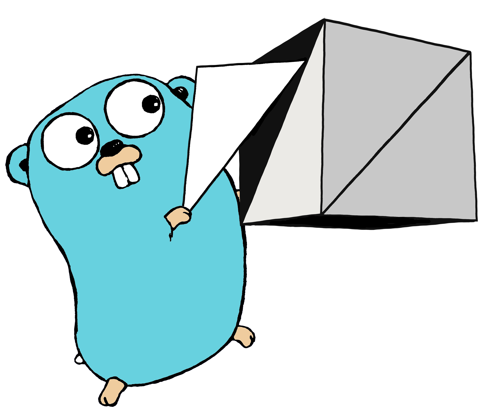

# Learn OpenGL


I'm busy following the tutorial on https://learnopengl.com. Only difference is I'm going to be using Go instead of C++. I'm also not doing the same structure, divided things up a bit more, but not too much and it should be easy to find the same/similar code.

## Install

You can download and build directly from the source: 

```sh
$ go get github.com/PetrusJPrinsloo/learnopengl
```
You will need to have gcc installed and in your PATH on windows. I have not tested this on Linux or Mac, but I would imagine you should have build tools installed there as well. This is because the GL and GLFW librarie are still C libraries and Go requires gcc to compile them.
## Configure

To change how the application runs just edit the default.json file in the root of the project.

```json
{
    "width": 1000,
    "height": 1000,
}
```

* `"width": 1000` Width of the window.
* `"height": 1000` Height of the window.
